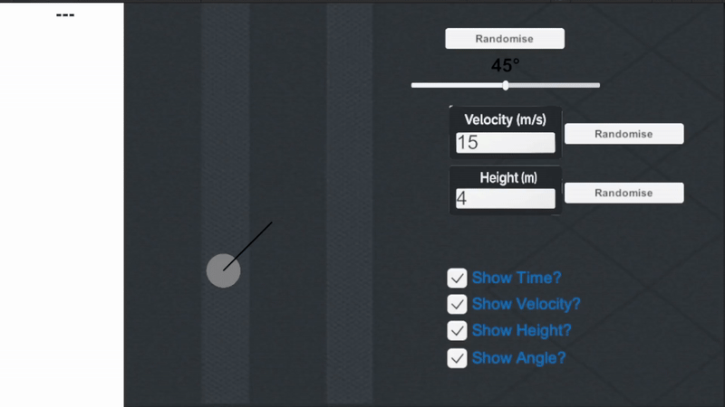
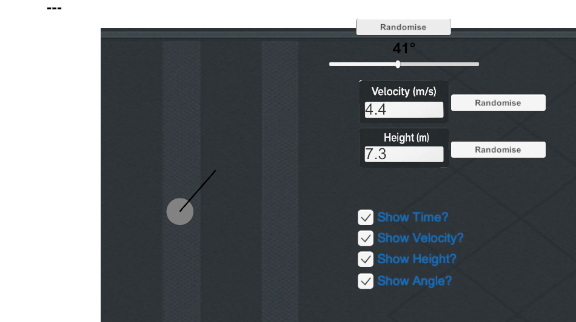
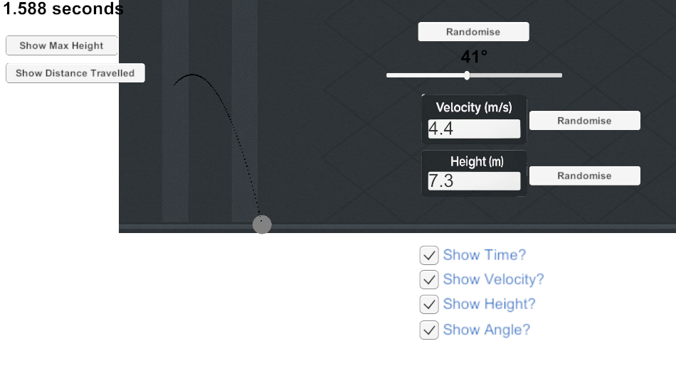

Kinetiq - A Physics Mechanics Visualizer
========================================

Kinetiq is an interactive projectile motion simulator built in Unity that helps users visualize key concepts in A-Level Mechanics. With real-time visual feedback and customizable parameters, it's perfect for students, teachers, and anyone wanting to deepen their understanding of 2D motion, vectors, and forces.

FEATURES
--------
- Projectile Simulation: Launch an object based on user-defined velocity, angle, and height with accurate physics.
- Real-Time Calculations: 
  • Time Elapsed
  • Maximum Height
  • Horizontal Distance Travelled
- Physics-Based Logic (SUVAT): Live application of motion equations used in A-Level Mechanics.
- Customizable Inputs: 
  • Angle (via slider)
  • Initial Velocity (m/s)
  • Launch Height (m)
  • Toggle UI components
- Randomize Mode: Instantly generate random motion scenarios to test yourself.
- Learning Through Trial: Make predictions and then test them in the simulation.
- Dynamic Environment: Infinite-scrolling floor and background, auto zoom-out camera for long-range shots.
- Quick Restart: Press 'R' anytime to reset and try again.

HOW TO USE
----------
1. Clone the repo:
   git clone https://github.com/Taz371/Kinetiq.git

2. Open in Unity:
   - Open Unity Hub
   - Add the project folder
   - Open the scene

3. Run the Simulation:
   - Adjust angle, velocity, and height
   - Press SPACE to launch
   - Press R to reset

THE PHYSICS & LOGIC BEHIND KINETIQ
----------------------------------

This project is built using SUVAT equations, the foundation of motion in A-Level Mechanics.

EQUATIONS USED:
- Horizontal Distance (Range):
  s = v × t × cos(θ)

- Maximum Height:
  h = (v × sin(θ))² / (2g)
  Derived from: v² = u² + 2as

- Time of Flight (tracked in simulation):
  s = ut + 0.5at²

- Velocity Components:
  • Horizontal: v_x = v × cos(θ)
  • Vertical: v_y = v × sin(θ)

TEST YOURSELF
-------------
- Solve a projectile problem manually, then compare with Kinetiq.
- Adjust variables like angle, velocity, and height to explore edge cases.
- Build intuition through visual trial and prediction.

CODE INSIGHT
------------
In the Unity script:

    float angleInRadians = (-angleSlider.value + 90f) * Mathf.Deg2Rad;
    Vector2 direction = new Vector2(Mathf.Cos(angleInRadians), Mathf.Sin(angleInRadians)).normalized;
    rb.AddForce(direction * velocity, ForceMode2D.Impulse);

This mimics vector decomposition — just like solving mechanics problems on paper.

SCREENSHOTS
-----------

BUILT WITH
----------
- Unity 2D
- C# scripting (MonoBehaviour)
- Unity UI Toolkit

EDUCATIONAL VALUE
-----------------
Perfect for:
- A-Level Mechanics revision
- GCSE Physics support
- Teachers and classroom demonstrations
- Self-testing and motion problem solving
